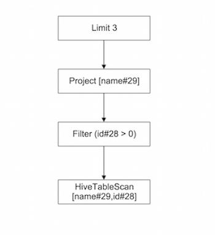

# Spark SQL源码分析

## Spark-Sql 整体流程
1. parseSQL(sql) => unresolvedLogicalPlan <: LogicalPlan
     通过词法分析和语法分析将sql转化成Unresolved LogicalPlan。
2. analyzer.execute(unresolvedLogicalPlan) => resolvedLogicalPlan <: LogicalPlan
     通过analyzer结合catalog对数据源进行绑定，生成resolved LogicalPlan
3. optimizer.execute(resolvedLogicalPlan) => optimizedLogicalPlan <: LogicalPlan
     采用optimizer中定义的规则对resolved LogicalPlan进行优化，生成optimized LogicalPlan。
4. planner.plan(optimizedLogicalPlan).next() => sparkPlan <: SparkPlan
     使用planner把logica planner转化成spark plan
5. prepareForExecution.execute(sparkPlan) => executedPlan <: SparkPlan
6. executedPlan.execute() => RDD[Row]
     调用executedPlan的execute()，生成RDD返回。

其中unresolvedLogicalPlan、resolvedLogicalPlan和optimizedLogicalPlan都是LogicalPlan，sparkPlan和executedPlan是SparkPlan。

## SQLContext类
spark sql提供了两个sqlcontext，一个是默认是的SQLContext，另外一个是继承SQLContext的HiveContext。HiveContext重写了SQLContext部分方法和变量，为了整合hiveQL。

### 1.SQLContext主要成员方法和变量
<pre><code>
protected[sql] lazy val catalog: Catalog
protected[sql] lazy val functionRegistry: FunctionRegistry
protected[sql] lazy val analyzer: Analyzer
protected[sql] val ddlParser
protected[sql] val sqlParser
protected[sql] def dialectClassName  //DefaultParserDialect
protected[sql] def parseSql(sql: String): LogicalPlan
protected[sql] def executeSql(sql: String): this.QueryExecution
protected[sql] val tlSession  //对SQLSession进行ThreadLocal封装
protected[sql] class SQLSession //对SQLConf的封装
def sql(sqlText: String): DataFrame  //编译sql
protected[sql] class SparkPlanner extends SparkStrategies  
protected[sql] val planner = new SparkPlanner
protected[sql] val prepareForExecution  //
protected[sql] class QueryExecution(val logical: LogicalPlan)
object implicits  //rdd到Dataframe的隐式转化
~~~
load、jdbc、jsonFile等各种生成DataFrame的方法
~~~
</code></pre>

### 2.HiveContext重写的方法或者变量
<pre><code>
override protected[sql] lazy val catalog
override protected[sql] lazy val functionRegistry
override protected[sql] lazy val analyzer: Analyzer
protected[sql] override def parseSql(sql: String): LogicalPlan
override protected[sql] def dialectClassName  //HiveQLDialect
override protected[sql] def createSession(): SQLSession
private val hivePlanner = new SparkPlanner with HiveStrategies
override protected[sql] val planner = hivePlanner
</code></pre>

### 3.SQLContext vs HiveContext
1. catalog是用于数据绑定的字典，SQLContext中catalog=new SimpleCatalog(conf)，HiveContext中catalog=new HiveMetastoreCatalog(metadataHive, this)。
2. functionRegistry用于注册临时用户定义的临时函数SQLContext中functionRegistry=new SimpleFunctionRegistry(conf)，HiveContext中functionRegistry=new HiveFunctionRegistry
3. analyzer在两则中分别用各自的catalog和functionRegistry构建。analyzer = new Analyzer(catalog, functionRegistry, conf)
4. parseSql使用哪个sql解析器（ParseDialect）是有dialectClassName决定的，在SQLContext中dialectClassName是DefaultParserDialect，HiveContext中是HiveQLDialect。dialectClassName的名字是有参数spark.sql.dialect决定的，可以通过修改改变量选择不同sql解析器。
5. SQLContext使用使用SparkPlanner作为planner，planner = new SparkPlanner。HiveContex中planner = hivePlanner，hivePlanner = new SparkPlanner with HiveStrategies，HiveStrategies是trait，相对于SparkPlanner，hivePlanner增加了HiveCommandStrategy、HiveDDLStrategy等策略。

##Spark-shell创建SQLContext

~~~ 
  @DeveloperApi
  def createSQLContext(): SQLContext = {
    val name = "org.apache.spark.sql.hive.HiveContext"
    val loader = Utils.getContextOrSparkClassLoader
    try {
      sqlContext = loader.loadClass(name).getConstructor(classOf[SparkContext])
        .newInstance(sparkContext).asInstanceOf[SQLContext] 
      logInfo("Created sql context (with Hive support)..")
    }
    catch {
      case _: java.lang.ClassNotFoundException | _: java.lang.NoClassDefFoundError =>
        sqlContext = new SQLContext(sparkContext)
        logInfo("Created sql context..")
    }
    sqlContext
  }
~~~

- 用反射的方法先尝试创建HiveContext，如果失败则退化成SQLContext。所以，spark-shell是优先使用HiveContext。

## HiveContext.sql(sqlText: String)剖析
### 1.shell实例
<pre><code>
scala> sqlContext.sql("desc test_partition").collect.foreach(println)
[id,int,null]
[name,string,null]
[dt,string,null]
[# Partition Information,,]
[# col_name,data_type,comment]
[dt,string,null]
</code></pre>
表test_partition有id、name两个字段，dt为partition字段。

<pre><code>
scala> val query = sqlContext.sql("select name from test_partition where id > 0 limit 3")
query: org.apache.spark.sql.DataFrame = [name: string]
</code></pre>
sqlContext.sql()返回一个DataFrame

<pre><code>
scala> query.printSchema
root
 |-- name: string (nullable = true)
</code></pre>
打印出来的DataFrame的schema

<pre><code> 
scala> query.queryExecution
res8: org.apache.spark.sql.SQLContext#QueryExecution =
== Parsed Logical Plan ==
'Limit 3
 'Project ['name]
  'Filter ('id > 0)
   'UnresolvedRelation [test_partition], None

== Analyzed Logical Plan ==
name: string
Limit 3
 Project [name#29]
  Filter (id#28 > 0)
   MetastoreRelation xitong, test_partition, None

== Optimized Logical Plan ==
Limit 3
 Project [name#29]
  Filter (id#28 > 0)
   MetastoreRelation xitong, test_partition, None

== Physical Plan ==
Limit 3
 Project [name#29]
  Filter (id#28 > 0)
   HiveTableScan [name#29,id#28], (MetastoreRelation xitong, test_partition, None), None

Code Generation: false
== RDD ==
</code></pre>
打印整个QueryException，相当于query.queryExecution.logical + query.queryExecution.analyzed + query.queryExecution.optimizedPlan + query.queryExecution.sparkPlan + query.queryExecution.executedPlan 。
     LogicalPlan和SparkPlan皆为树状结构，如：
<pre><code>
scala> query.queryExecution.logical
res16: org.apache.spark.sql.catalyst.plans.logical.LogicalPlan =
'Limit 3
 'Project ['name]
  'Filter ('id > 0)
   'UnresolvedRelation [test_partition], None

scala> query.queryExecution.logical.children
res17: Seq[org.apache.spark.sql.catalyst.plans.logical.LogicalPlan] =
List('Project ['name]
 'Filter ('id > 0)
  'UnresolvedRelation [test_partition], None
)

scala> query.queryExecution.executedPlan
res20: org.apache.spark.sql.execution.SparkPlan =
Limit 3
 Project [name#29]
  Filter (id#28 > 0)
   HiveTableScan [name#29,id#28], (MetastoreRelation xitong, test_partition, None), None

scala> query.queryExecution.executedPlan.children
res21: Seq[org.apache.spark.sql.execution.SparkPlan] =
List(Project [name#29]
 Filter (id#28 > 0)
  HiveTableScan [name#29,id#28], (MetastoreRelation xitong, test_partition, None), None
)
</code></pre>

### 2.sql(sqlText: String)代码分析
<pre><code>
  def sql(sqlText: String): DataFrame = {
    DataFrame(this, parseSql(sqlText))
  }
</code></pre>
sql()方法返回的是个DataFrame，传入构造函数的参数是本身（SQLContext）和parseSql()返回的LogicalPlan。

## parseSql过程分析
<pre><code>
  protected[sql] def parseSql(sql: String): LogicalPlan = ddlParser.parse(sql, false)
  ...
  
  protected[sql] val ddlParser = new DDLParser(sqlParser.parse(_))
  ...
  
  protected[sql] val sqlParser = new SparkSQLParser(getSQLDialect().parse(_))
  
  protected[sql] def getSQLDialect(): ParserDialect = {
    try {
      val clazz = Utils.classForName(dialectClassName)
      clazz.newInstance().asInstanceOf[ParserDialect]
    } catch {
      case NonFatal(e) =>
        // Since we didn't find the available SQL Dialect, it will fail even for SET command:
        // SET spark.sql.dialect=sql; Let's reset as default dialect automatically.
        val dialect = conf.dialect
        // reset the sql dialect
        conf.unsetConf(SQLConf.DIALECT)
        // throw out the exception, and the default sql dialect will take effect for next query.
        throw new DialectException(
          s"""Instantiating dialect '$dialect' failed.
             |Reverting to default dialect '${conf.dialect}'""".stripMargin, e)
    }
  }
</code></pre>
上述代码中用dialectClassName类的初始化SparkParse，前面已经提到dialectClassName在HiveContex中为HiveQLDialect。HiveQLDialect的定义如下：
<pre><code>
private[hive] class HiveQLDialect extends ParserDialect {
  override def parse(sqlText: String): LogicalPlan = {
    HiveQl.parseSql(sqlText)
  }
}
</code></pre>
可见HiveContext的parseSql实际上使用的是HiveQl.parseSql(sqlText)做sql解析。HiveQl.parse的实现调用了ExtendedHiveQlParser中得parse()方法，如下：
<pre><code>
protected val hqlParser = new ExtendedHiveQlParser

/** Returns a LogicalPlan for a given HiveQL string. */
def parseSql(sql: String): LogicalPlan = hqlParser.parse(sql)
</code></pre>

ExtendedHiveQlParser继承与抽象类AbstractSparkSQLParser。AbstractSparkSQLParser的主要实现有ExtendedHiveQlParser、SqlParser、DDLParser、SparkSQLParser。默认的SQLContex中得DefaultParserDialect使用的是SqlParser。AbstractSparkSQLParser的继承关系如下：
 ***此处有张图*** 
具体sql的解析是调用了AbstractSparkSQLParser.parse()函数，代码比较晦涩，展开看下：

<pre><code>
  def parse(input: String): LogicalPlan = {
    // Initialize the Keywords.
    initLexical
    phrase(start)(new lexical.Scanner(input)) match {
      case Success(plan, _) => plan
      case failureOrError => sys.error(failureOrError.toString)
    }
  }
</code></pre>

## analyzer分析

## planner分析

## SparkPlan.execute()分析

## 总结

## TODO

